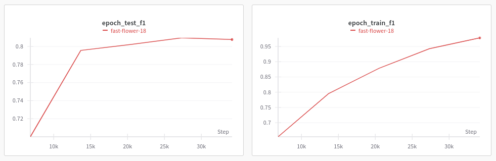
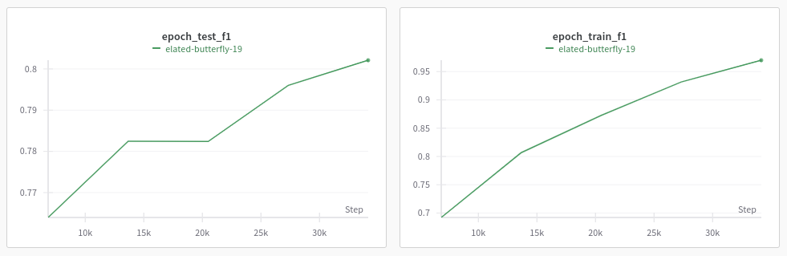
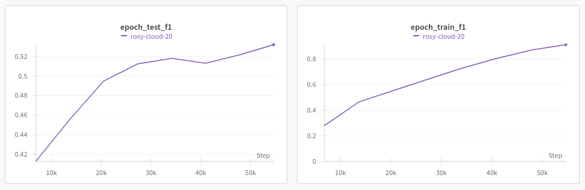

# Классификаторы текстов

## Предобработка предоставленного датасета

Содержится в [блокноте]("notebooks/preprocessing.ipynb").

## Обучение классификаторов №1

Содержится в [блокноте]("notebooks/cls2.ipynb").

Обучались 3 классифкатора для категорий "Исполнитель", "Группа тем", "Тема".

Результаты обучения. Взвешенная F1 на тестовой подвыборке (10% предоставленных предобработанных текстов):

```
Исполнитель		0.8095
Группа тем		0.8021
Тема			0.5321
```

Результаты хода обучения









## Инференс

Скачать файлы моделек:
* `models/executors`: https://drive.google.com/file/d/1WDk5zo1d1BQdii2Omdv45eZoXzqdZK8-/view?usp=sharing
* `models/theme_groups`: https://drive.google.com/file/d/1591MfRMEcI-0v0vNgtIhB5dUscR5kUZ5/view?usp=sharing
* `models/theme`: https://drive.google.com/file/d/1Nnh-zLfoamjd21zTA7WExFYS0iVqHzRa/view?usp=sharing

Распаковать в папку `models`, для каждой модели своё имя:
* `models/executors`
* `models/theme_groups`
* `models/theme`

Запуск - `inference.py`

## Обучение объединённого классификатора

Содержится в [блокноте]("notebooks/jointcls.ipynb"). Единая модель для классификации категорий "Исполнитель", "Группа тем", "Тема".

Результаты обучения. Взвешенная F1 на тестовой подвыборке (10% предоставленных предобработанных текстов):

```
Исполнитель		0.802
Группа тем		0.819
Тема			0.544
```

Скачать модель:

* `models/latest.pt`: https://drive.google.com/file/d/1wxrKg1tDU8oWjxpwRDq4tWbzpx0uJ_Tr/view?usp=sharing

Запуск - `inference2.py`
